# MyNews
An Android news app that fetches news from The New York Times API.

 

**MyNews Vimeo video 📽️ 👇**

 
 
### Deliverables

For this project, you'll submit a .zip file containing:

-   Your Android Studio project
-   Functional documentation of the final application, with your elective functionality included, in PDF format
-   **New**  - A test execution report generated by the continuous integration program you have selected. No particular format is required.

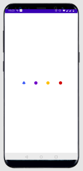 &ensp;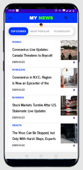
&ensp;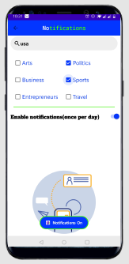

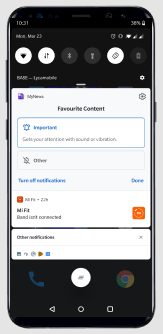 &ensp;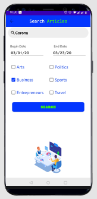 &ensp;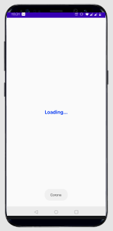
&ensp;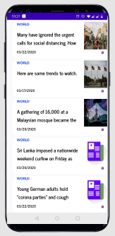&ensp;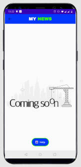

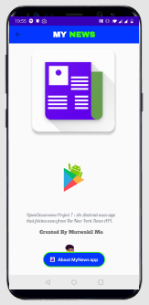 &ensp;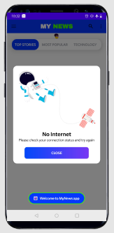

### Skills

-   Implement integration tests
    
-   Write an interface unit test
    
-   Write an Android unit test
    
-   Produce a test execution report
    
-   Implement unit tests
    
-   Program and run a background task
    
-   Provide a fix when suggested by the test execution report
    
-   Save user preferences
    
-   Architect a user interface in XML
    
-   Access remote data
    
-   Use widgets for user interactions
## Libraries Used

* [Android Support Library](https://developer.android.com/topic/libraries/support-library/)
* [CircleCi](https://circleci.com/)
* [lottie-android](https://github.com/airbnb/lottie-android)
* [Butterknife](https://github.com/JakeWharton/butterknife)
* [Retrofit](https://github.com/square/retrofit)
* [okhttp-logging-interceptor](https://github.com/square/okhttp/tree/master/okhttp-logging-interceptor#logging-interceptor)
* [Glide](https://github.com/bumptech/glide)
* [gson](https://github.com/google/gson)
* [KenBurnsView](https://github.com/flavioarfaria/KenBurnsView)
* [Shimmer-android](https://github.com/facebook/shimmer-android)
* [leakcanary](https://github.com/square/leakcanary)

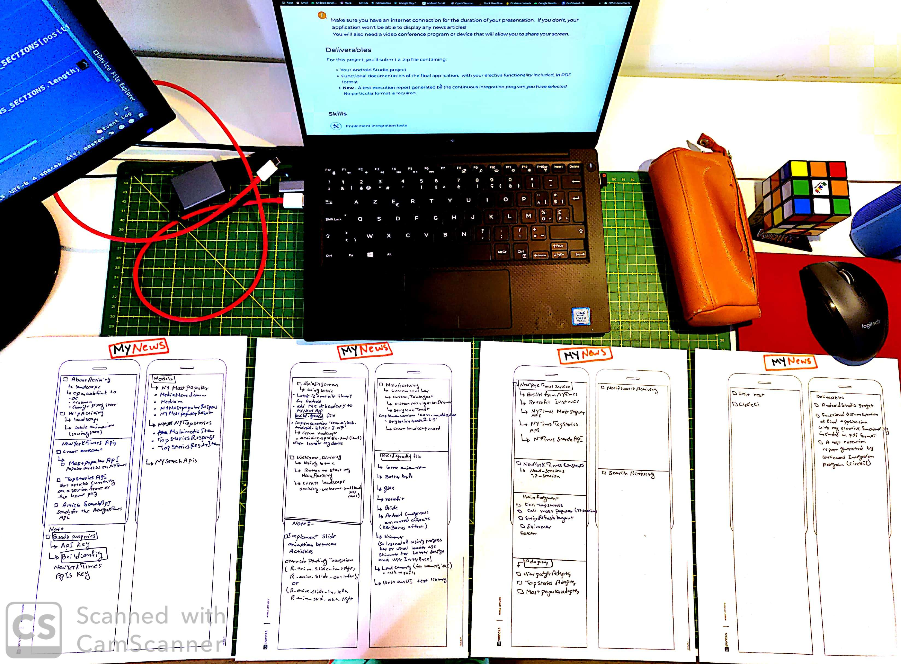&ensp;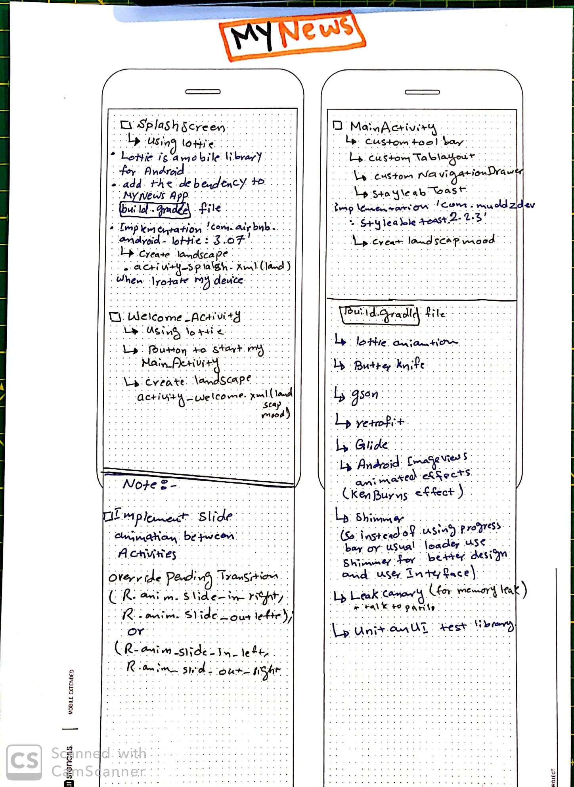
&ensp;
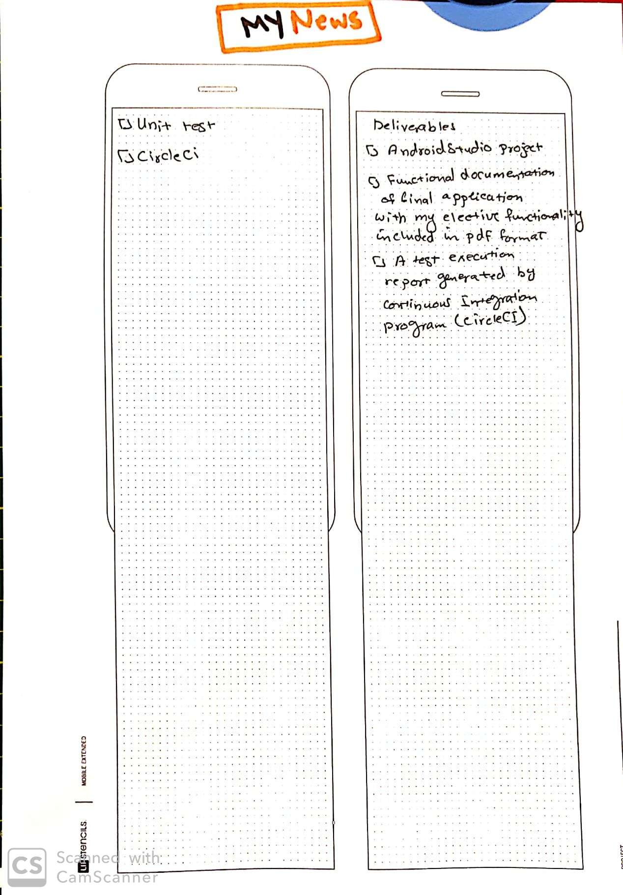

## Developed By

[**Mutwakil Mo**](https://www.linkedin.com/in/mutwakil-mo/)

## License

    Copyright 2020 Mutwakil Mo

    Licensed under the Apache License, Version 2.0 (the "License");
    you may not use this file except in compliance with the License.
    You may obtain a copy of the License at

         http://www.apache.org/licenses/LICENSE-2.0

    Unless required by applicable law or agreed to in writing, software
    distributed under the License is distributed on an "AS IS" BASIS,
    WITHOUT WARRANTIES OR CONDITIONS OF ANY KIND, either express or implied.
    See the License for the specific language governing permissions and
    limitations under the License.
